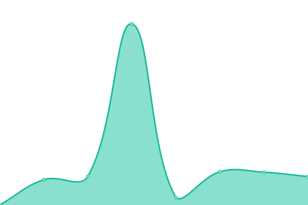
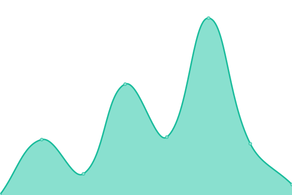
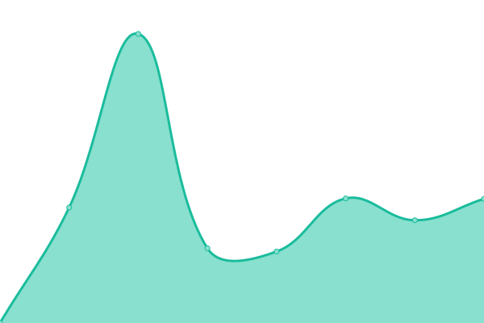

# [📈 Live Status](https://upptime.github.io/upptime): <!--live status--> **🟧 Partial outage**

This repository contains the open-source uptime monitor and status page for [Upptime](https://upptime.js.org), powered by [Upptime](https://github.com/upptime/upptime).

With [Upptime](https://upptime.js.org), you can get your own unlimited and free uptime monitor and status page, powered entirely by a GitHub repository. We use [Issues](https://github.com/upptime/upptime/issues) as incident reports, [Actions](https://github.com/ironnysh/upptime/actions) as uptime monitors, and [Pages](https://upptime.github.io/upptime) for the status page.

<!--start: status pages-->
<!-- This summary is generated by Upptime (https://github.com/upptime/upptime) -->
<!-- Do not edit this manually, your changes will be overwritten -->
<!-- prettier-ignore -->
| URL | Status | History | Response Time | Uptime |
| --- | ------ | ------- | ------------- | ------ |
|  [Swart](https://swart-berlin.de) | 🟩 Up | [swart.yml](https://github.com/ironnysh/upptime/commits/HEAD/history/swart.yml) | 

 444ms
     
 | 

<a href="https://ironnysh.github.io/upptime/history/swart">100.00%</a>
    

|  [Air Freelance](https://www.air-freelance.com) | 🟩 Up | [air-freelance.yml](https://github.com/ironnysh/upptime/commits/HEAD/history/air-freelance.yml) | 

 168ms
     
 | 

<a href="https://ironnysh.github.io/upptime/history/air-freelance">100.00%</a>
    

|  [Spitz Magazine](https://spitz-magazine.vercel.app) | 🟩 Up | [spitz-magazine.yml](https://github.com/ironnysh/upptime/commits/HEAD/history/spitz-magazine.yml) | 

 275ms
     
 | 

<a href="https://ironnysh.github.io/upptime/history/spitz-magazine">100.00%</a>
    

|  [Pasta della Casa](https://pastadellacasa.com) | 🟩 Up | [pasta-della-casa.yml](https://github.com/ironnysh/upptime/commits/HEAD/history/pasta-della-casa.yml) | 

 542ms
     
 | 

<a href="https://ironnysh.github.io/upptime/history/pasta-della-casa">100.00%</a>
    

|  [iRonnysh](https://ironnysh.com) | 🟥 Down | [i-ronnysh.yml](https://github.com/ironnysh/upptime/commits/HEAD/history/i-ronnysh.yml) | 

 301ms
     
 | 

<a href="https://ironnysh.github.io/upptime/history/i-ronnysh">47.72%</a>
    

|  [Greek Goddess](https://irisganor.com) | 🟩 Up | [greek-goddess.yml](https://github.com/ironnysh/upptime/commits/HEAD/history/greek-goddess.yml) | 

 589ms
     
 | 

<a href="https://ironnysh.github.io/upptime/history/greek-goddess">100.00%</a>
    

|  [Mighty](https://mighty-site.vercel.app) | 🟩 Up | [mighty.yml](https://github.com/ironnysh/upptime/commits/HEAD/history/mighty.yml) | 

 458ms
     
 | 

<a href="https://ironnysh.github.io/upptime/history/mighty">98.87%</a>
    

<!--end: status pages-->

[**Visit our status website →**](https://ironnysh.github.io/upptime/)

## 📄 License

- Powered by: [Upptime](https://github.com/upptime/upptime)
- Code: [MIT](./LICENSE) © [Upptime](https://upptime.js.org)
- Data in the `./history` directory: [Open Database License](https://opendatacommons.org/licenses/odbl/1-0/)
